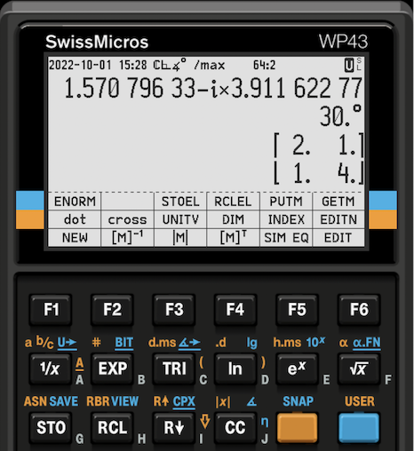

# WP43 Firmware

The *WP43* pocket calculator is a new fast, compact, reliable, and solid problem solver like you never owned before – instant on, fully programmable, incorporating a state-of-the-art high-resolution display, customizable by you, connecting to your computer, and RPN – a serious scientific instrument supporting you in your studies and professional activities. It readily provides advanced capabilities never before combined so conveniently in a true pocket-size calculator.

## Getting involved

- Regular announcements about the project are made on the [SwissMicros "Discuss!" forum](https://forum.swissmicros.com/viewforum.php?f=2).
- A simulator is available for download on the [Releases page](https://gitlab.com/wpcalculators/wp43/-/releases).
- Bugs and improvements can be reported on the [Issues page](https://gitlab.com/wpcalculators/wp43/-/issues).
- Read more about how to be involved in development on the [project Wiki](https://gitlab.com/wpcalculators/wp43/-/wikis/home).

## Status
- Specifications and manuals are mostly complete.
- [SwissMicros](https://www.swissmicros.com) are developing the *WP43* hardware.
- Firmware development takes place using the [SwissMicros *DM42*](https://www.swissmicros.com/product/dm42) calculator as a platform and using a software simulator running under Windows, macOS, and Linux.
- The aim is to create a serious scientific instrument like we did with the [*WP 34S*](https://sourceforge.net/projects/wp34s/).

## Features
- A *Solver* (root finder) that can solve for any variable in any equation.
- An *Integrator* for computing definite integrals of arbitrary functions
- Numeric derivation, programmable sums and products.
- A wealth of functions operating on real and complex numbers, fractions, integers, dates, times, and text strings.
- A comprehensive set of statistical operations including probability distributions, data analysis functions, curve fitting, forecasting, and measuring system analysis.
- Vector and matrix operations in real and complex domain, including a comfortable *Matrix Editor*, dot and cross products, eigenvalues, eigenvectors, and a solver for systems of linear equations.
- Base conversions and integer arithmetic in fifteen bases from binary to hexadecimal. Bit manipulations in words of up to 64 *bits*.
- An easy-to-use *menu* system utilizing the lower display part to assign up to eighteen operations according to your actual needs to the top row of keys.
- Easy system control via named *system flags* and variables.
- Keystroke programming including branching, loops, tests, *flags*, subroutines, and program-specific local data.
- A *USB-C* socket allowing for external power supply as well as for program exchange with a computer, so you can edit, debug, and test routines there and return them verified to your WP43.
- A *catalog* for reviewing all *items* stored in memory – be they defined by us or created and programmed by you – using alphabetic search.
- A user interface you can customize. You can save various custom keyboard layouts on-board and recall them one by one as you need them. Dedicated keyboard overlays are supported.
- Battery-fail-safe on-board backup for all your data and settings. Also backups can be exchanged with others stored on your computer.
- A timer (or stopwatch) based on a real-time clock.
- An infrared port for immediate recording of results, calculations, programs, and data using e.g. an *HP 82240A/B Infrared Printer*.

*WP43* provides the amplest function set ever seen in an *RPN calculator*:

- More than 680 functions, including *Euler's Beta* and *Riemann's Zeta*, *Lambert's W*, *Bessel functions* of first kind, *Bernoulli* and *Fibonacci numbers*, *Jacobi elliptic functions* and *integrals*, as well as the *Chebyshev*, *Hermite*, *Laguerre*, and *Legendre* polynomials (no table books or running computer software in these matters anymore).
- 14 probability distributions: general *normal (Gaussian)*, *Student's t*, *chi-square*, *Fisher's F*, *Poisson*, *binomial*, *geometric*, *hypergeometric*, *Cauchy-Lorentz*, *exponential*, *logistic*, *Weibull*, and more.
- 10 curve fitting models featuring two or three parameters (linear, orthogonal, exponential, logarithmic, power, root, hyperbolic, parabolic, Cauchy and Gauss peak).
- Over 50 fundamental physical constants (following CODATA 2018) as used today by national standards institutes like *NIST* or *PTB*, plus important mathematical, astronomical, and surveying constants.
- 126 unit conversions, mainly from old *British Imperial* to universal *SI* units and vice versa.
- Plus a complete set of financial functions and applications for the inevitable business matters.

Furthermore, the *WP43* features lots of space for your data, programs, and ideas:
- A high-resolution low-power dot-matrix display showing crisp results and *menus*, allowing for natural matrix display as well as for a wide variety of mathematical symbols, Greek and extended Latin letters.
- Your choice of a workspace of 4 or 8 *stack registers* and up to 107 global *general purpose registers*, each taking any object of arbitrary *data type* (be it a matrix, a vector, a text string, or any number of arbitrary kind).
- Up to 1000 named variables. Also each such variable can take any object of arbitrary *data type*.
- 112 global *user flags* and 39 named *system flags*.
- 32 local *user flags* and up to 100 local *registers* per program, allowing e.g. for recursive programming.
- Up to 10 000 program steps per program, a total of some 20 000 in *RAM*, about 30 000 in *flash memory*.